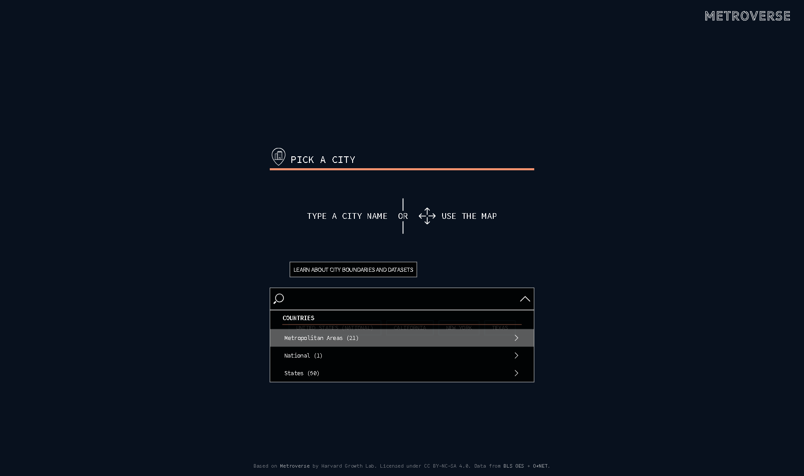
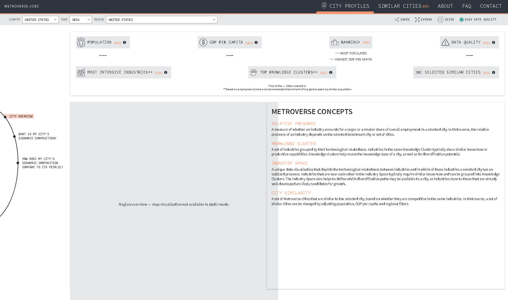
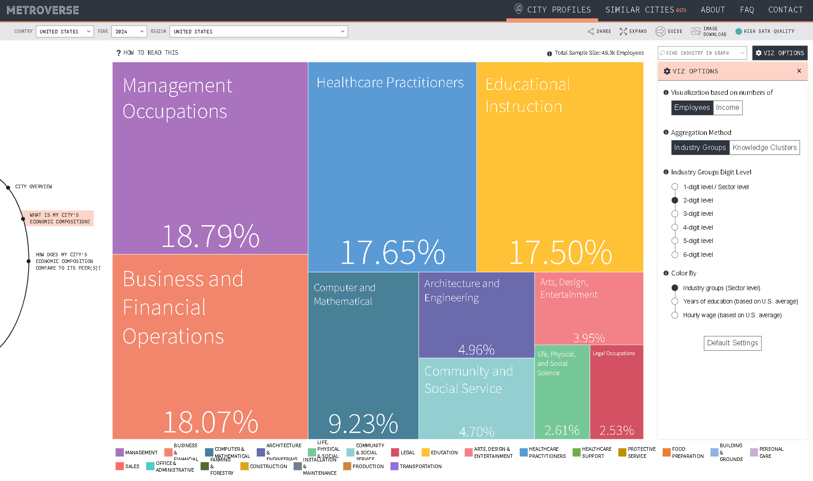
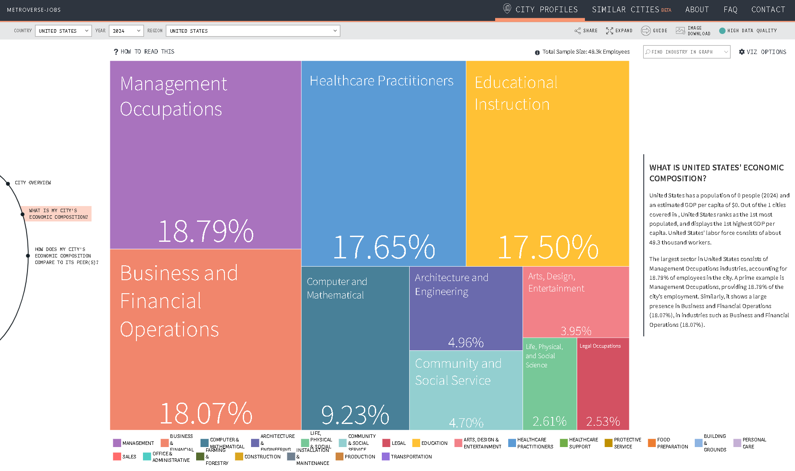
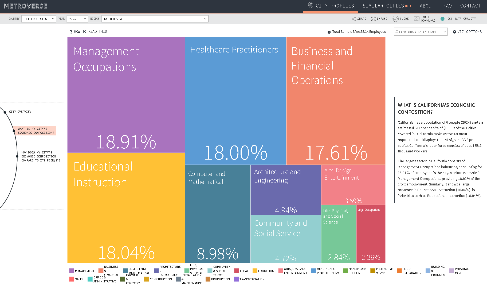

# Metroverse Jobs

A static visualization tool for US Bureau of Labor Statistics (BLS) occupation data, built on the [Metroverse](https://github.com/harvard-growth-lab/metroverse-front-end) frontend by Harvard Growth Lab.

## Screenshots

### Landing Page
Region selector with National, Metropolitan, and State groupings.



### Region Overview
3-dropdown navigation: Country, Year, and Region selector.



### Economic Composition Treemap
Interactive treemap showing occupation distribution by employment share. US National data with 22 SOC major groups.


### Viz Options Panel
Toggle between Employees/Income view, set digit level (1-6), color by sector/education/wage.



### Tooltip with SOC Code
Hover any occupation to see SOC code, year, share, and employment count.



### State-Level View (California)
Region switching updates treemap data. California shown with 58.1k workers across 22 occupation groups.



## Features

- **Economic Composition Treemap**: Interactive canvas treemap showing occupation distribution by employment or income
- **Region Profiles**: View data for National, State, and Metropolitan regions
- **3-Dropdown Navigation**: Country, Year, and Region selectors with grouped optgroups
- **Multiple Color Modes**: Color by SOC Major Group, Annual Wage, or Complexity Score
- **Configurable Digit Levels**: View data at sector (1-digit) through detailed (6-digit) SOC levels
- **Shareable URLs**: All filter settings encoded in URL query parameters
- **Static Deployment**: No backend required, works on GitHub Pages

## Data Sources

- [BLS Occupational Employment and Wage Statistics (OES)](https://www.bls.gov/oes/)
- [O*NET Online](https://www.onetonline.org/) (for complexity scores)

## Getting Started

```bash
npm install    # Install dependencies (Node 16 recommended)
npm start      # Dev server at localhost:3000
npm run build  # Production build
```

No `.env` file is required - this project uses static data files instead of API calls.

## Generating Data

```bash
# Requires ../bls2/ project with pipeline data
python scripts/generate-static-data.py
```

## Primary Technologies

- **[TypeScript](https://www.typescriptlang.org/), v3.7** - core language
- **[React](https://reactjs.org/), v16.13** - core framework
- **[Styled Components](https://styled-components.com/), v5.1** - CSS-in-JS styling
- **[D3](https://d3js.org/), v5.16** - data processing and utilities
- **[Fluent](https://projectfluent.org/), v0.13** - internationalization
- **[react-canvas-treemap](https://github.com/cid-harvard/react-canvas-treemap)** - treemap visualization (MIT)

## License

[CC BY-NC-SA 4.0](https://creativecommons.org/licenses/by-nc-sa/4.0/) - Same as the original Metroverse.

## Attribution

Based on [Metroverse](https://metroverse.cid.harvard.edu/) by the Harvard Growth Lab, Center for International Development at Harvard University. See [ATTRIBUTION.md](ATTRIBUTION.md) for details.
